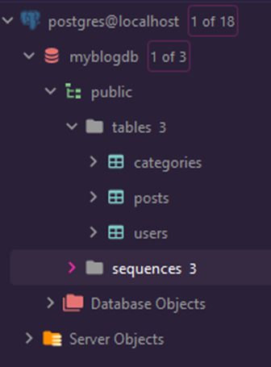
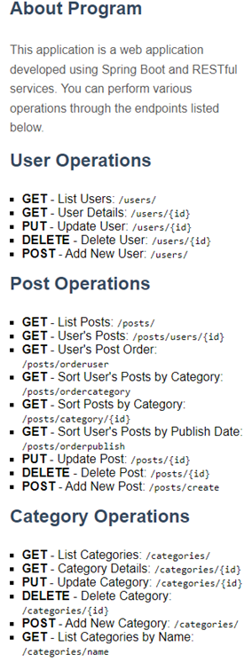
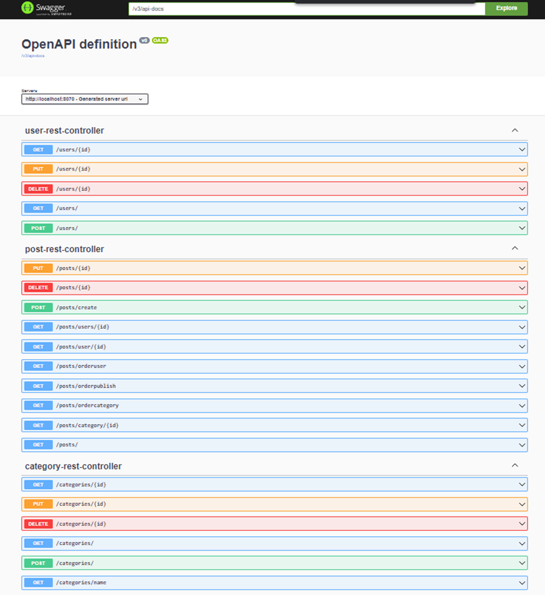
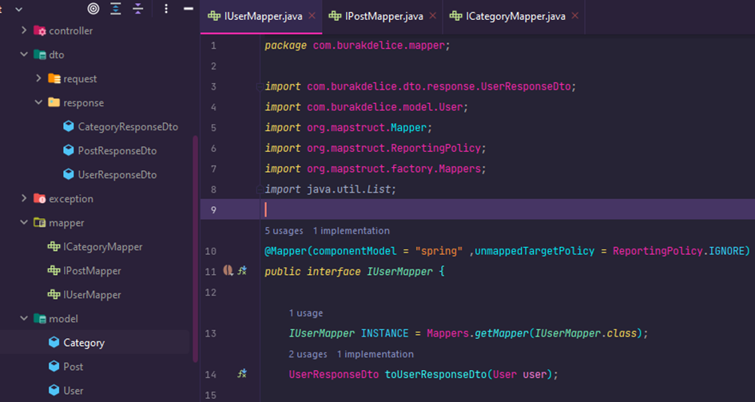
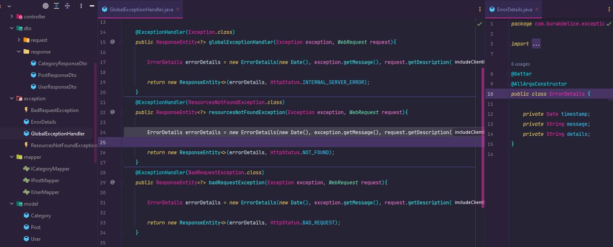
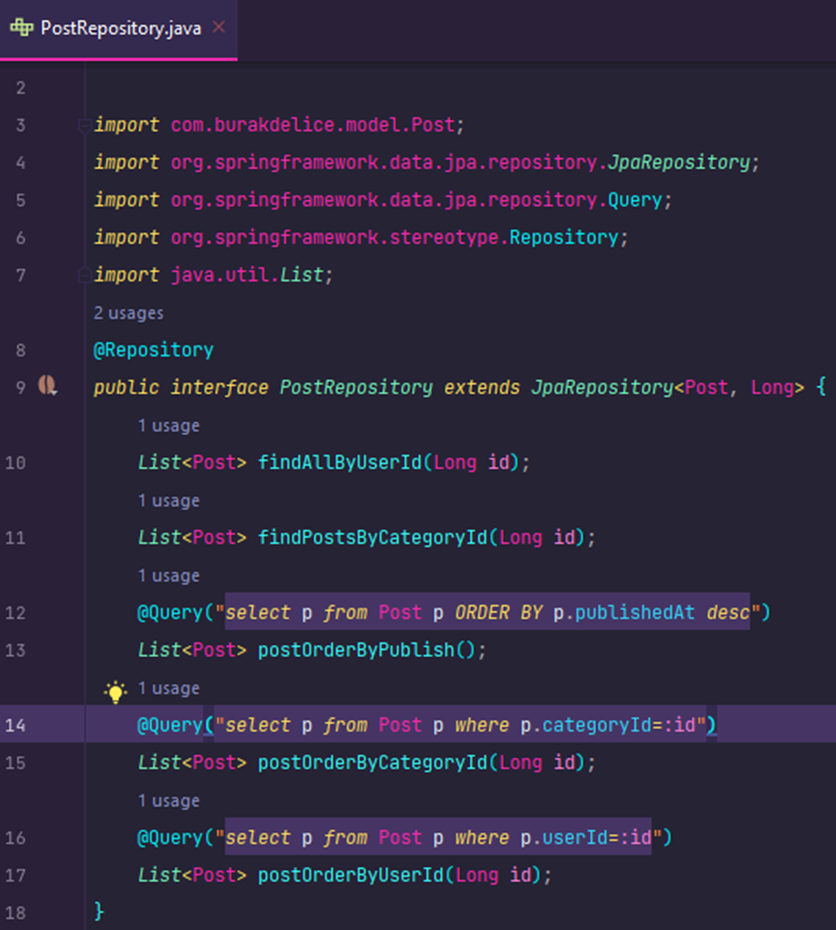

SpringBoot Monolithic Restful API Project
This project aims to develop a blog platform where users can write, read, and comment on blog posts. It utilizes Spring Boot and Spring Data JPA to provide a comprehensive RESTful API for managing various aspects of the blog platform.

Project Overview
The project is organized into several key phases:

Database and ORM:

PostgreSQL is used to create and manage the project's database.
Spring Data JPA is employed to handle database operations.
Database Schema:

The database schema consists of three main tables: "users," "posts," and "categories."
Each table is defined with relevant columns to store necessary information.
REST API Endpoints:

CRUD (Create, Read, Update, Delete) operations are implemented for users, blog posts, and categories.
Additional endpoints allow filtering blog posts based on search keywords and categories.
DTOs and Object Mapping:

Entity and Data Transfer Object (DTO) classes are segregated into separate packages.
Mapping between entity and DTO classes is facilitated using the MapStruct library.
Mapper classes are created for each entity-DTO pair to ensure smooth data conversion.
Error Handling (Exceptions):

HTTP status codes and meaningful error messages are consistently applied to handle various error scenarios.
A global error handling mechanism ensures proper management of exceptions.
Listing and Filtering:

Blog posts are sorted based on their publication dates.
Filtering options are available to list posts within specific categories and authored by particular users.
Swagger API Testing
The project's endpoints have been thoroughly tested using Swagger API documentation. Swagger provides a user-friendly interface to interact with the API, making it convenient to validate and verify the functionality of each endpoint.

Getting Started
To run the project locally, follow these steps:

Clone the repository: git clone https://github.com/burakdelice/_MonoliticSpringBoot_.git
Navigate to the project directory: cd project-repo
Build and run the project: mvn spring-boot:run
Access the Swagger UI: http://localhost:8070/swagger-ui.html
Please refer to the API documentation in the Swagger UI for detailed information on each endpoint and their usage.

Here are some screenshots of the project in action:

Conclusion
This project showcases the implementation of a monolithic Spring Boot application that serves as a RESTful API-driven blog platform. It offers users the ability to create, read, and engage with blog content while adhering to modern software development practices.

Feel free to contribute, provide feedback, or customize the project according to your needs.

Author: Burak DELİCE